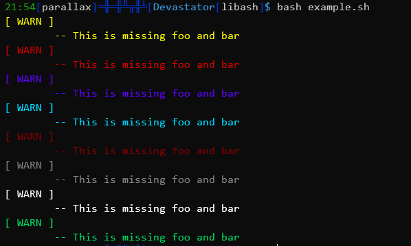
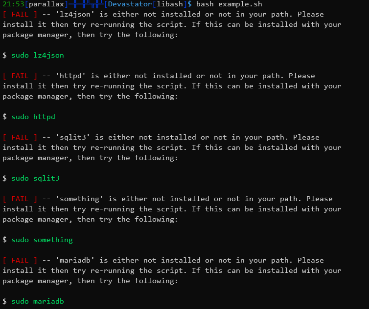
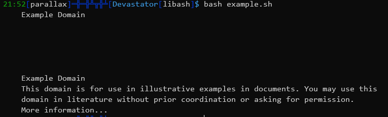
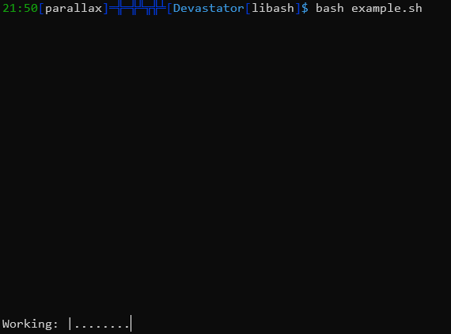
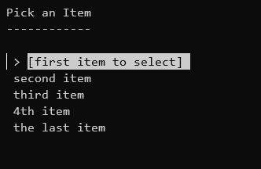

# libash

A library with a bunch of dynamic bash functions to make things easier for scripting.


## How to use

1. clone the repo wherever you would like

	```
	git clone git@github.com:paralllax/libash.git
	```

2.  copy the libash file to the directory or subdirectory of your script. Alternatively, you can copy it to somewhere more static like /etc/. 

	```
	cp libash /path/of/script/dir
	```

3. In your script add the relative or absolute path depending on where you placed it, as per the below 3 examples. If you want to use these on the command line instead, add the source to your .bashrc or /etc/bashrc (For global use).

	```
	source 'libash'
	source 'ssubdir/libash'
	source '/etc/libash'
	```

	Then simply call the functions in your script

## Supported functions/examples
* * *
#### Index

 - [Requirements](#req)
 - [version_check](#version)
 - [colorize](#color)
 - [package_check](#package)
 - [html_strip](#html)
 - [idle_spinner](#idle)
 - [create_menu](#menu)
 - [youtube_bash_dl](#ytdl)
 - [rev_portf](#port)

* * *

#### Requirements<a name=req></a>

 - Pup
	If you end up using the youtube_bash_dl function, this does rely on a 3rd party tool - pup. It is a command line html parser we use. You can see their install instructions [here](https://github.com/ericchiang/pup)

- jq / ffmpeg
	A [jq] tool used to parse json and another [ffpmeg] tool used to extract the audio, both used for the youtube_bash_dl function. This should exist in the default repositories of your distrobution. You can install it with your package manager via one of the following. Note that if you are on fedora, you may need the RPMfusion repository to get ffmpeg. 

	```
	sudo apt install jq ffmpeg 
	sudo yum install jq ffmpeg
	sudo pacman -Sy jq ffmpeg
	```

* * *

#### version_check<a name=version></a>

This requires no arguments. It will check your repository for updates, then return a message if it needs to be updated.

```
version_check
```

* * *

#### colorize<a name=color></a>

This will return the text, but wrapped in color. You specify the color, then it's easiest to send the text as a variable. Note that if you want tabs and new lines, you will need to escape the sequence. (\t \n). Supported colors at the moment are Dark Red, Red, Light Green, Yellow, Sky Blue, Blue, Light Grey, and White. If you want more, let me know.

| Color       | Tag      |
|-------------|----------|
| Red         | red      |
| Dark Red    | dk_red   |
| Yellow      | yellow   |
| Light Green | lt_green |
| Sky Blue    | sk_blue  |
| Blue        | blue     |
| Light Grey  | lt_grey  |
| White       | white    |

```
colorize <color> <${TEXT_VARIABLE}>
```

Here are some examples of what the code may look like

```
warn_message="[ WARN ] \n\t-- This is missing foo and bar"

colorize yellow ${warn_message}
colorize red ${warn_message}
colorize blue ${warn_message}
colorize sk_blue ${warn_message}
colorize dk_red ${warn_message}
colorize lt_grey ${warn_message}
colorize white ${warn_message}
colorize lt_green ${warn_message}
```

This will return the following:



* * *

#### package_check<a name=package></a>

This will check the system for any installed packages, then return an error for any that aren't installed. This is useful if your script needs packages that aren't installed on the base images. You can also toggle an option to add color. If you don't want color, leave the option out and it will print normally.

```
package_check [COLOR_ON] <package1 package2  package3>
```

Example:

```
package_check vim lz4json httpd sqlit3 something mariadb
```

It may look something like this:



* * *

#### html_strip<a name=html></a>

This will parse a URL and strip out all of the html tags and all of the CSS. Leaving behind the raw text, which can be very useful in scraping/parsing web pages.

```
html_strip <URL>
```

An example of this is below:

```
text=$(html_strip "example.com")
printf "${text}\n"
```

Which returns the following:



* * *

#### idle_spinner<a name=idle></a>

This will display a spinning bar and a message of your choice while a task runs in the background. This is handy if you have some task that may take a while, but want the user to know the script is still running. The message is optional.

```
idle_spinner [message]
```
Here is an example of what some code may look like. Note that a more meaningful function or command would be run in place of sleep. That is purely for testing purposes. Note that the function MUST follow RIGHT AFTER the function you want 'timed', so that it can capture the correct PID. 

```
sleep 15 &
idle_spinner "Working: "
```

Here is what it may look like:



* * *

#### create_menu<a name=menu></a>

A simple function that will create a arrow key navigate-able menu for the user to iterate through. When they pick an option, the function returns a code equal to the option number. 

```
create_menu ["${title}"] [${menu_items}]
```

Here is an example of what your code may look like. Note that you MUST include the newline flags. The title MUST also be encapsulated in quotes, the menu items do not need to however. It would probably be easiest to use a case statement following to continue the logic/execute the next task for the script. 

```
title="Pick an Item"
my_menu="
first item to select\n
second item\n
third item\n
4th item\n
the last item"

create_menu "${title}" ${my_menu}
client_choice=$?

case ${client_choice} in
	1) echo picked 1;;
	2) echo picked 2;;
	3) echo picked 3;;
	4) echo picked 4;;
	5) echo picked 5;;
esac
```

Here is what the results may look like:


* * *

#### youtube_bash_dl<a name=ytdl></a>

A basic function to download a youtube video. There are two examples, in the first, it will download the raw vide. In the second, it will provide only the audio. You do not need to add extensions when you specify the name. The script will add the extensions automatically. If you need a more comprehensive downloader with better functions, you'll be better off using the original youtube_dl. Here is an example of the function syntax:

```
youtube_bash_dl "https://...." "Name of file"
```

If you want to only extract the audio, you can add the `-a` or `--audio` flag at the end. 

```
youtube_bash_dl "https://...." "Name of file" [-a/--audio]
```

* * *

#### rev_portf<a name=port></a>

Creates a reverse ssh proxy to the target host.

```
rev_portf  <dest password> <dest user> <dest host> <dest port> <local port>
```

Note that when your script completes, the tunnel will close/be killed. If you need to kill/close the tunnel before then, call the following with no aruments

```
close_rev_portf
```

Here is an example of what your code may look like. Something more meaningful would go in place of the netcat command. 

```
rev_portf  mybadpass user01 192.168.1.22 22 4242
echo | nc -c localhost:4242
close_rev_portf
```
